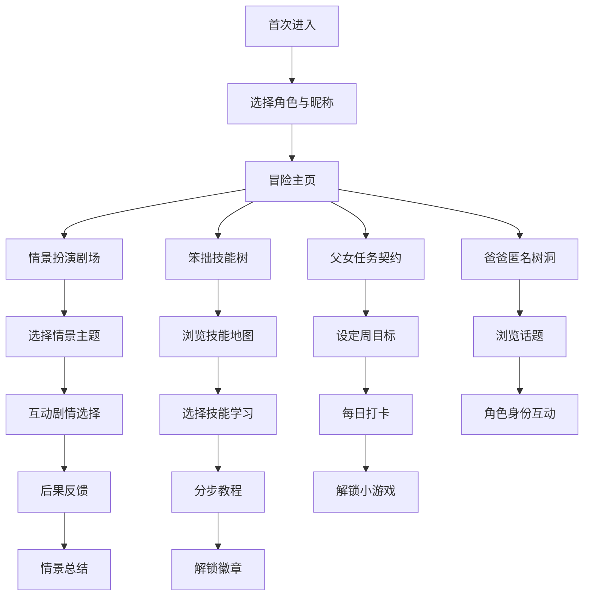

## 1. 产品概述

**单亲爸爸育儿大冒险**是一款面向单亲父亲（尤其是独自抚养女儿的父亲）的游戏化育儿辅助Web应用。通过角色扮演、技能学习、任务契约和匿名社区四大核心模块，以温暖幽默的方式化解育儿困境，帮助单亲爸爸在"不会问、无处问"的窘境中获得实用指导和情感支持。

- 目标用户：独自抚养女儿的单亲父亲，尤其是面对女儿青春期敏感话题感到无所适从的爸爸们
- 产品价值：将沉重的育儿焦虑转化为可探索的冒险旅程，用游戏化机制降低求助门槛，用幽默化解尴尬

## 2. 核心功能

### 2.1 用户角色

| 角色 | 进入方式 | 核心权限 |
|------|----------|----------|
| 冒险爸爸 | 匿名注册（选择游戏角色头像+昵称） | 浏览所有模块、参与情景剧场、技能学习、发布任务契约、进入树洞社区 |

### 2.2 功能模块

1. **冒险主页面**：角色展示、冒险进度、快捷入口、每日推荐
2. **情景扮演剧场**：互动剧情模拟、选项分支、后果反馈、情景回顾
3. **笨拙技能树**：游戏化技能教程、技能解锁进度、成就徽章
4. **父女任务契约**：每周目标设定、完成打卡、双人协作小游戏
5. **爸爸匿名树洞**：角色身份发帖、回帖互动、话题分类、情感支持

### 2.3 页面详情

| 页面名称 | 模块名称 | 功能描述 |
|----------|----------|----------|
| 冒险主页 | 角色展示区 | 显示当前角色形象、等级、冒险称号 |
| 冒险主页 | 冒险进度地图 | 以地图形式展示已解锁情景、已学会技能、已完成任务 |
| 冒险主页 | 每日推荐卡片 | 推荐今日情景挑战/技能学习/社区热帖 |
| 冒险主页 | 快捷导航 | 四大模块入口，图标+文字导航 |
| 情景剧场 | 情景选择列表 | 按年龄/主题分类的情景列表（初潮、霸凌、青春期等） |
| 情景剧场 | 互动剧情界面 | 角色对话+场景描述+选项按钮，选择后展示后果反馈 |
| 情景剧场 | 情景回顾与评分 | 完成情景后展示选择路径图、最佳实践提示 |
| 技能树 | 技能地图 | 以树状图展示所有技能节点及解锁关系 |
| 技能树 | 技能教程页 | 分步骤教程（图文+动画），幽默化呈现 |
| 技能树 | 成就徽章墙 | 展示已获得的技能成就徽章 |
| 任务契约 | 本周契约卡 | 显示本周设定的小目标列表、完成状态 |
| 任务契约 | 契约编辑器 | 添加/编辑/删除每周小目标 |
| 任务契约 | 协作小游戏 | 完成任务后解锁的父女互动小游戏 |
| 匿名树洞 | 话题列表 | 按标签分类的帖子列表 |
| 匿名树洞 | 帖子详情 | 帖子内容+角色身份回帖互动 |
| 匿名树洞 | 发帖编辑器 | 选择角色身份后发布新帖 |

## 3. 核心流程

**新手引导流程**：用户首次进入 → 选择游戏角色（骑士/勇者/守护者等） → 设定昵称 → 简短引导动画 → 进入冒险主页

**情景剧场流程**：用户选择情景 → 进入剧情场景 → 面临选项分支 → 选择后展示后果反馈 → 继续剧情或回溯 → 完成后展示总结与建议

**技能学习流程**：浏览技能树 → 选择未解锁技能 → 完成前置任务 → 观看分步教程 → 实践打卡 → 解锁徽章

**任务契约流程**：设定本周小目标 → 每日打卡 → 全部完成 → 解锁协作小游戏

## 4. 用户界面设计

### 4.1 设计风格

- **主色调**：暖橙色（#FF8C42）作为冒险活力色 + 深海军蓝（#1B2A4A）作为稳重底色 + 奶油白（#FFF8F0）作为温暖背景
- **辅助色**：柔粉色（#FFB5C2）用于女儿相关元素、翠绿色（#4ECDC4）用于成就与完成状态、金黄色（#FFD93D）用于徽章与奖励
- **按钮风格**：圆润的3D凸起按钮，带有微妙的阴影和按压反馈，类似游戏UI风格
- **字体**：标题使用圆润有力的手写风格字体（如 ZCOOL KuaiLe），正文使用清晰温暖的圆体（如 Noto Sans SC Rounded）
- **布局风格**：卡片式布局+地图式导航，大量使用圆角、柔和阴影、插画元素
- **图标/表情**：手绘风格的冒险主题图标（盾牌、剑、魔法书、地图），温暖可爱的表情符号点缀
- **整体氛围**：RPG冒险游戏风格，温暖治愈，用"冒险"隐喻化解育儿的沉重感

### 4.2 页面设计概览

| 页面名称 | 模块名称 | UI元素 |
|----------|----------|--------|
| 冒险主页 | 角色展示区 | 角色头像+等级徽章，暖橙渐变背景，发光边框 |
| 冒险主页 | 冒险进度地图 | 手绘风格地图，已解锁区域亮色，未解锁灰暗，路径连线 |
| 冒险主页 | 每日推荐卡片 | 3D凸起卡片，悬停上浮动画，图标+标题+描述 |
| 冒险主页 | 快捷导航 | 4个圆形图标按钮，脉冲动画提示，底部固定导航栏 |
| 情景剧场 | 情景选择列表 | 卡片式列表，每个卡片含场景插图+标题+难度标签 |
| 情景剧场 | 互动剧情界面 | 全屏沉浸式，漫画风场景背景+对话气泡+选项按钮 |
| 情景剧场 | 情景回顾 | 树状分支图，绿色/红色标记选择路径，底部总结卡 |
| 技能树 | 技能地图 | 树状结构图，发光节点+连线，已解锁节点金色光晕 |
| 技能树 | 技能教程页 | 分步手风琴面板，每步含插画+幽默文案+小贴士 |
| 技能树 | 成就徽章墙 | 网格排列圆形徽章，已获得彩色+闪光，未获得灰色轮廓 |
| 任务契约 | 本周契约卡 | 契约纸风格卡片，手写字体，复选框打卡 |
| 任务契约 | 协作小游戏 | 小游戏界面（如拼图、猜词），卡通风格 |
| 匿名树洞 | 话题列表 | 卡片列表，角色头像+昵称+发帖摘要，标签分类 |
| 匿名树洞 | 帖子详情 | 帖子内容+楼层式回帖，角色身份标识 |

### 4.3 响应式设计

- 桌面优先设计，主要针对平板和桌面端优化
- 移动端适配：底部固定导航栏，卡片单列排列，触摸友好的大按钮
- 触摸优化：所有交互元素最小44px触摸区域，滑动手势支持

### 4.4 3D场景指导

- 不涉及3D场景，采用2D手绘插画风格，营造温暖冒险氛围
- 使用CSS动画和SVG插画实现动态效果
