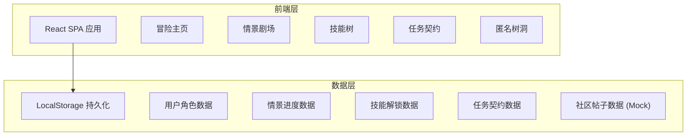
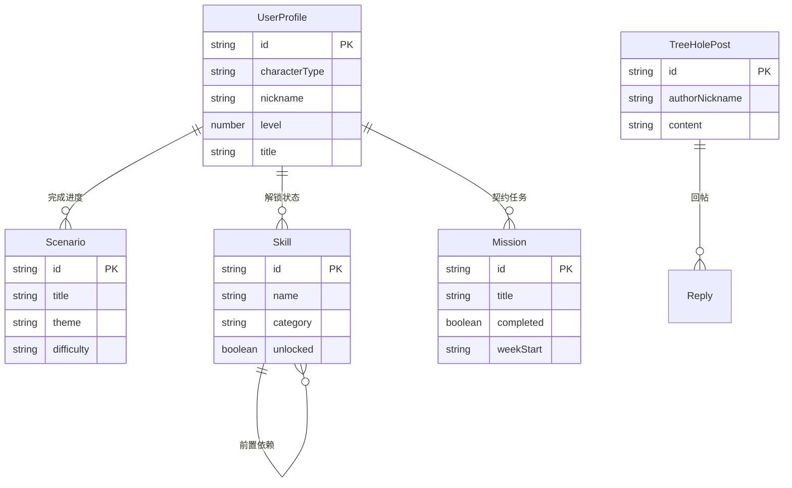

## 1. 架构设计



## 2. 技术说明

- **前端框架**：React@18 + TypeScript
- **样式方案**：Tailwind CSS@3 + CSS Modules（复杂动画）
- **构建工具**：Vite
- **动画库**：Framer Motion（页面过渡、交互动画）
- **图标库**：Lucide React
- **后端**：无后端，使用 LocalStorage 进行数据持久化，社区数据使用 Mock 数据
- **数据库**：无数据库，前端本地存储

## 3. 路由定义

| 路由 | 用途 |
|------|------|
| `/` | 新手引导/角色创建页 |
| `/home` | 冒险主页，展示角色、进度、推荐、导航 |
| `/theater` | 情景扮演剧场 - 情景选择列表 |
| `/theater/:scenarioId` | 情景扮演剧场 - 具体情景互动 |
| `/theater/:scenarioId/review` | 情景扮演剧场 - 情景回顾 |
| `/skills` | 笨拙技能树 - 技能地图 |
| `/skills/:skillId` | 笨拙技能树 - 具体技能教程 |
| `/skills/badges` | 笨拙技能树 - 成就徽章墙 |
| `/contract` | 父女任务契约 - 本周契约 |
| `/contract/mini-game/:gameId` | 父女任务契约 - 协作小游戏 |
| `/tree-hole` | 爸爸匿名树洞 - 话题列表 |
| `/tree-hole/:postId` | 爸爸匿名树洞 - 帖子详情 |

## 4. API定义

无后端API，所有数据通过前端本地存储和Mock数据提供。

### 4.1 数据类型定义

```typescript
interface UserProfile {
  id: string
  characterType: "knight" | "warrior" | "guardian" | "ranger"
  nickname: string
  level: number
  title: string
  createdAt: string
}

interface Scenario {
  id: string
  title: string
  description: string
  ageRange: string
  theme: string
  difficulty: "easy" | "medium" | "hard"
  coverImage: string
  scenes: Scene[]
}

interface Scene {
  id: string
  narration: string
  backgroundEmotion: string
  options: Option[]
}

interface Option {
  id: string
  text: string
  consequence: string
  feedback: string
  nextSceneId: string | null
  isRecommended: boolean
}

interface Skill {
  id: string
  name: string
  description: string
  icon: string
  category: string
  prerequisites: string[]
  steps: SkillStep[]
  unlocked: boolean
}

interface SkillStep {
  title: string
  content: string
  tip: string
}

interface Mission {
  id: string
  title: string
  description: string
  completed: boolean
  weekStart: string
}

interface TreeHolePost {
  id: string
  authorCharacter: string
  authorNickname: string
  content: string
  tags: string[]
  replies: Reply[]
  createdAt: string
}

interface Reply {
  id: string
  authorCharacter: string
  authorNickname: string
  content: string
  createdAt: string
}
```

## 5. 服务器架构图

无后端服务器，纯前端应用。

## 6. 数据模型

### 6.1 数据模型定义



### 6.2 Mock数据策略

- 情景数据：预设5-8个典型情景（初潮、校园霸凌、青春期情绪、早恋、学业压力等），每个情景含3-5个场景节点
- 技能数据：预设10-15个技能节点（扎辫子、缝纽扣、谈心、做便当、选衣服等），形成树状依赖
- 社区帖子：预设10-15条匿名帖子及回帖，模拟真实社区氛围
- 用户进度：LocalStorage存储，包括已完成情景、已解锁技能、任务契约状态
